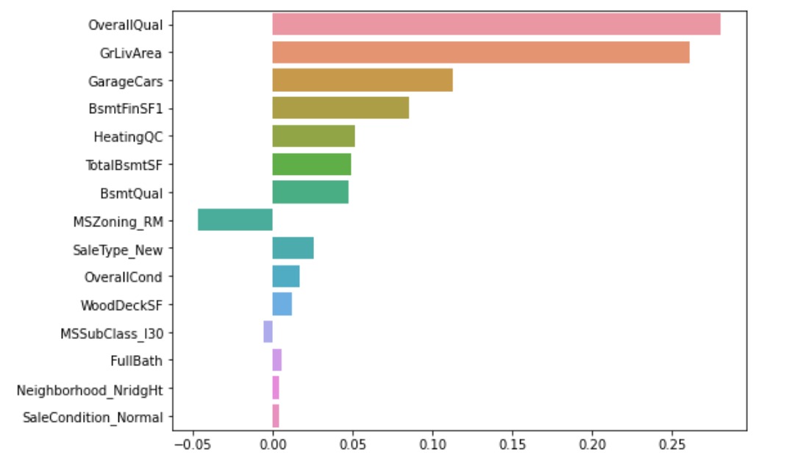

## House Price Prediction
This assignment is a programming assignment wherein we have to build a regularized multiple linear regression model for the prediction of House prices.. 

## General Information
A US-based housing company named Surprise Housing has decided to enter the Australian market. The company uses data analytics to purchase houses at a price below their actual values and flip them on at a higher price. For the same purpose, the company has collected a data set from the sale of houses in Australia. The data is provided in the CSV file below.

 The company is looking at prospective properties to buy to enter the market. You are required to build a regression model using regularisation in order to predict the actual value of the prospective properties and decide whether to invest in them or not.

The company wants to know:

    Which variables are significant in predicting the price of a house?
    How well those variables describe the price of a house?

## Business Objective

You are required to model the price of houses with the available independent variables. This model will then be used by the management to understand how exactly the prices vary with the variables. They can accordingly manipulate the strategy of the firm and concentrate on areas that will yield high returns. Further, the model will be a good way for management to understand the pricing dynamics of a new market.

## Conclusions
Multiple Linear Regression models using RFE, Ridge and Lasso were built.
The final model has 15 features.
The coefficient of each feature is given as a barplot 

## Technologies Used
- Numpy - version 1.21.4
- Pandas - version 1.3.4
- Seaborn - version 0.11.2
- Matplotlib - version 3.5.0
- Scikit-learn - version 1.0.2
- statsmodels - version 0.13.1

## Contact
Created by [@Nithin-Jacob] - feel free to contact me!
